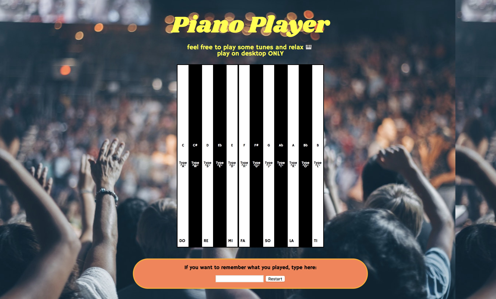

# Piano Keys Project
### Inspired by Wes Bos's 30 Days of JavaScript challenge 

Finished watching Day 1 of 30: the Drumkit challenge

I have decided to add some twist and use what I've learned to build a simple yet responsive keyboard/piano app, which I've been wanting to do for the longest time!

Here is the <a href = "http://chriscelledc.com/PianoKeysProject/"> live version </a> ! Enjoy. 

To learn more about the JavaScript30 challenge, check <a href = "https://javascript30.com/" > this </a> out. 